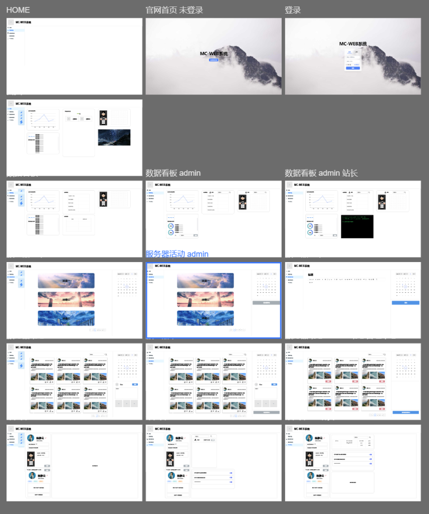

本来这篇文章两天前就该发出来了，但是服务器抽风，自动更新把站点异常关闭了，宝塔面板也跟着抽风，死活启动不了😒

系统的前端界面也都画出来了，大概长这样（懒得做站内预览了，放个缩略图就完事得了）

这个只是一个概览图，实际开发的时候遇见问题会微调的，但基本也就长这样。

前端开发是用VUE的，前端框架使用Vuetify开发，看他这个框架东西挺多的，然后官网也有中文文档，索性就用这个了。

但是有个问题，我开发前端需要给后端预留数据位置，但是后端我也不知道我需要传什么数据到前端，前端也不知道在哪给后端数据留位置。

可能得一边开发前端，一边写后端API手册了……

巨累！！！🙄
