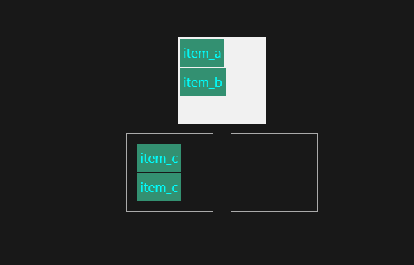
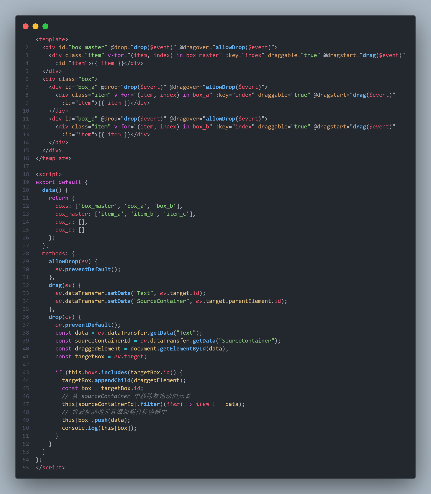
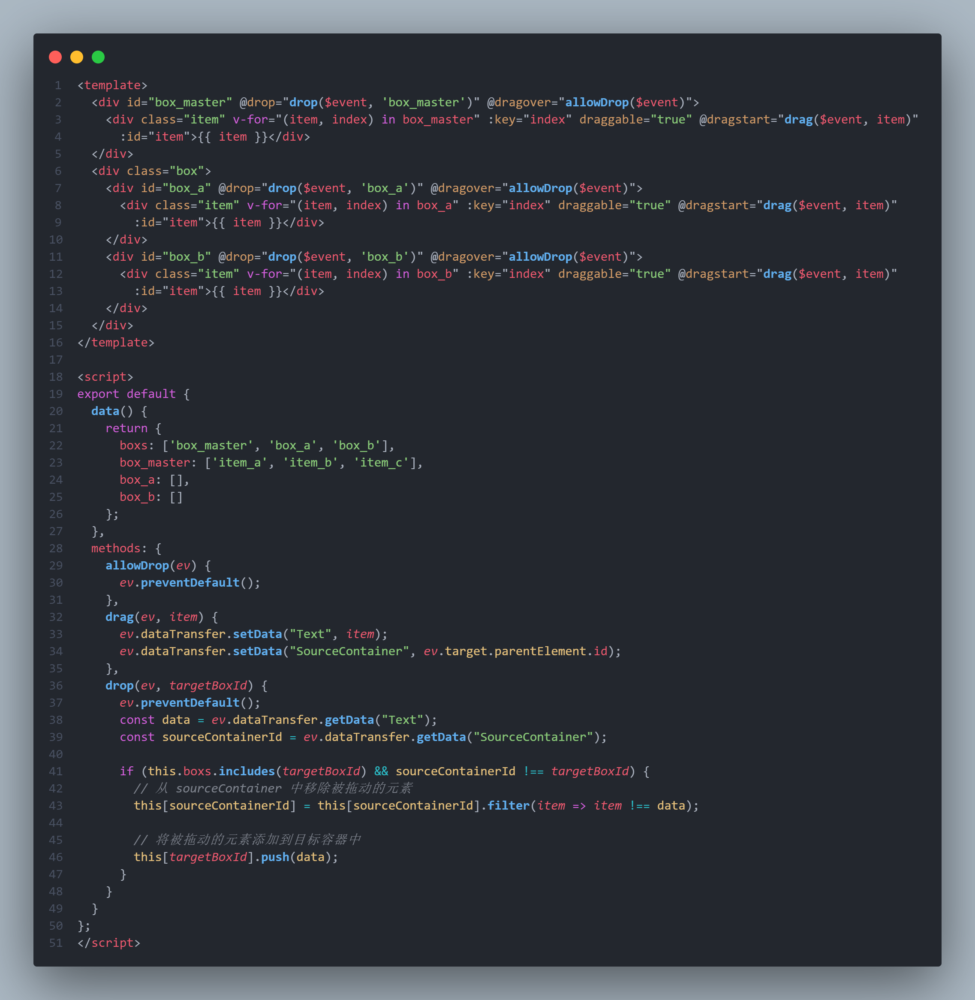

# ClickAllBlock

# Classify

## 使用变量而非直接this.操作data()中的数据

```js
this[<数据名>]
```

## 避免直接操作DOM，而是尽量使用VUE数据绑定

拖拽操作中targetBox.appendChild()方法与容器for循环渲染方法冲突，这样会导致拖拽操作结束后，容器中会出现两个相同id的item，这样会影响后续拖拽操作。



如果仅仅是实现视觉上拖拽，而不需要对拖拽后的数据进行逻辑处理，那么使用原生appendChild将DOM元素添加进去即可。

倘若使用了VUE for循环渲染元素，并且需要对拖拽结束后的数据进行处理，那么应该避免直接操作DOM，而是使用VUE的数据绑定

### 错与对

这里的DOM的appendChild与数组的push操作冲突了，为了使用数据绑定，删除对DOM的操作即可

#### 错



#### 对


